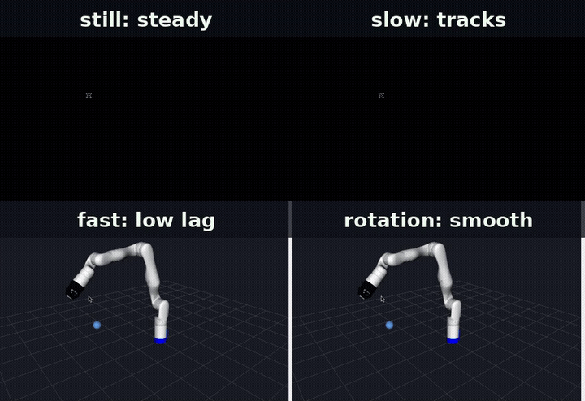
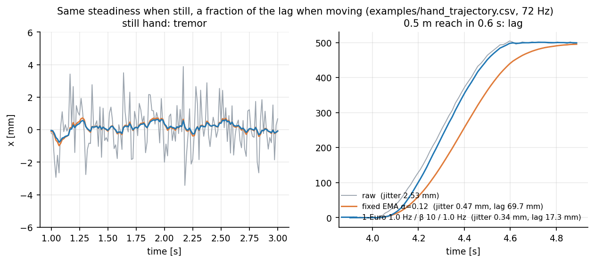
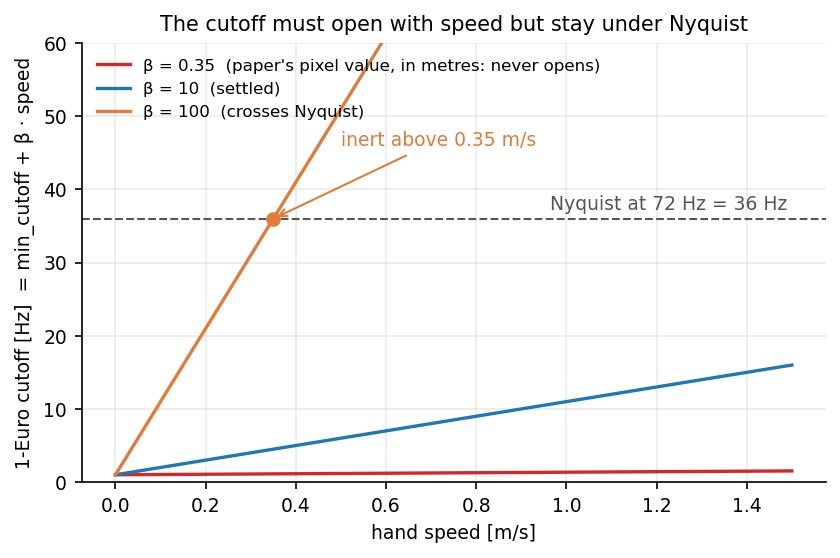
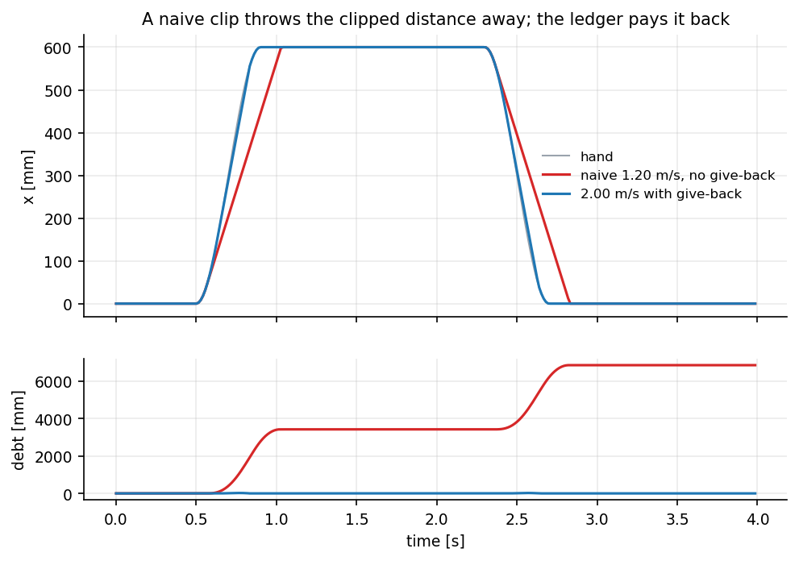
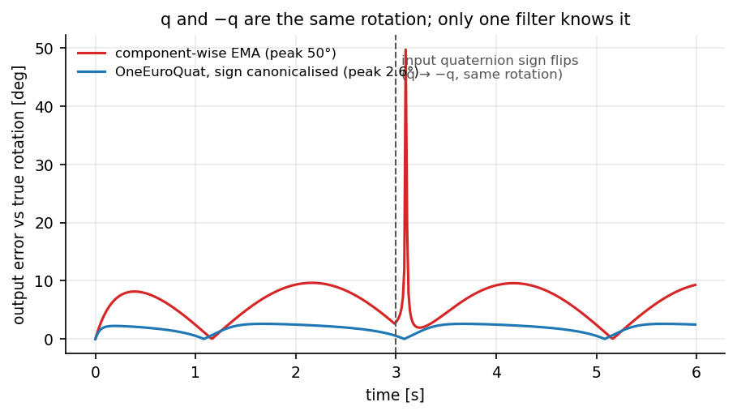
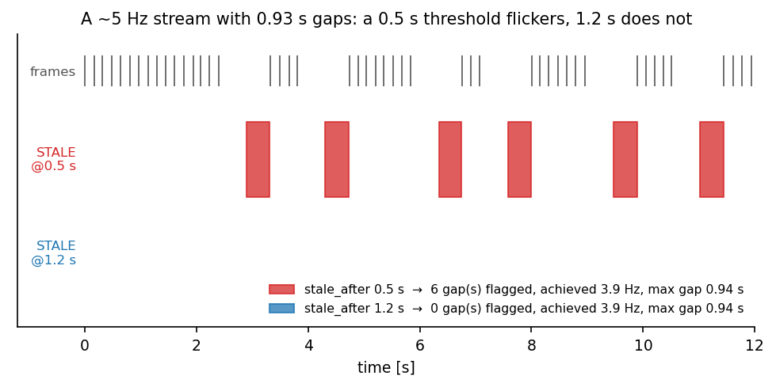
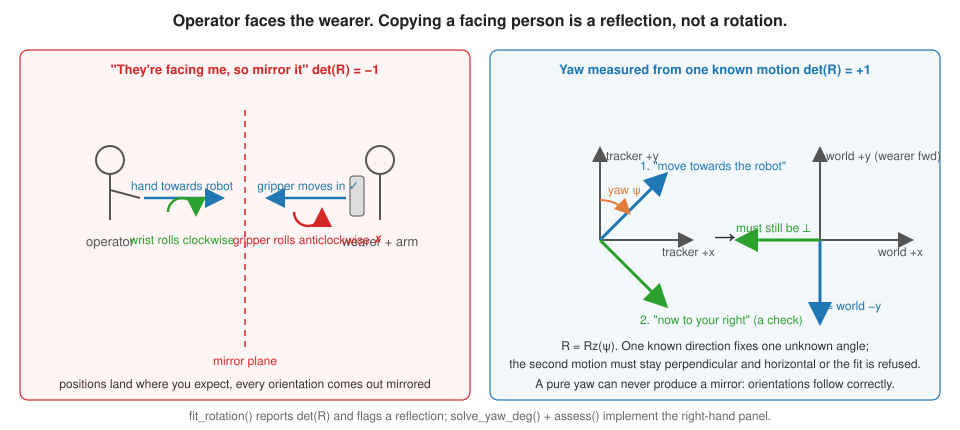
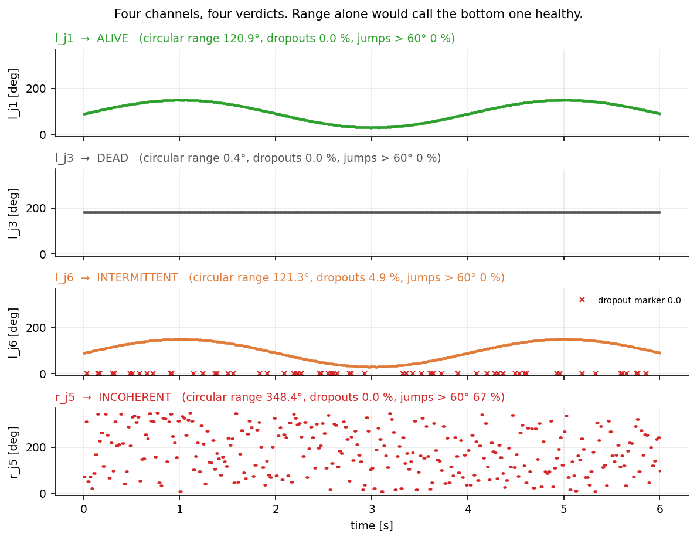

# SmoothOperator



*Four test scenarios in RViz (Kinova Gen3).*

**The signal layer between a human hand and a robot arm, done right once.**
dt-correct 1-Euro filters for position and rotation, a speed limit that pays
back what it clips, a rate meter that tells you what you actually get, a
frame alignment that refuses to hand you a mirror, and health verdicts for
rotary sensor channels. NumPy only. No ROS. Drop it into any teleop loop.

```
pip install git+https://github.com/megazron/smoothoperator-teleop
```

## The problem

small, general mistake that any teleop stack can make.

- **A fixed EMA cannot be both steady when still and tight when moving.**
  Tremor is high frequency at low amplitude; a reach is low frequency at high
  amplitude. One alpha trades them directly against each other. The answer is
  the 1-Euro filter (Casiez, Roussel & Vogel, CHI 2012): a low pass whose
  cutoff rises with speed.
- **The 1-Euro paper's beta is in pixels.** Copied into a signal in metres
  it never opens the cutoff. Measured: beta 0.35 gave **55.8 mm of lag at
  0.40 m/s** against 3.7 mm for the EMA it was meant to replace.
- **Over-correcting crosses Nyquist.** beta 100 in metres pushed the cutoff
  past 50 Hz above 0.5 m/s. A one-pole filter past Nyquist is inert, so it
  filtered nothing while the hand moved. The values that settled: min_cutoff
  **1.0 Hz**, beta **10**, d_cutoff **1.0 Hz**, rotation beta **3.0**.
- **Timer ticks are not regular.** A constant alpha per tick applies a
  different amount of filtering at 72 Hz, 100 Hz and under load. Every alpha
  here is computed from the measured dt.
- **q and −q are the same rotation.** A component-wise quaternion EMA that
  sees a sign flip interpolates the long way round and swings the wrist
  through 360° for no physical reason. This kit canonicalises the sign and
  slerps.
- **A naive speed clip throws distance away.** A 1.20 m/s limit on ordinary
  reaches left a lag that grew over a run. The fix was a human-sized limit
  (**2.00 m/s**) and keeping the clipped distance as a debt to pay back.
- **The configured rate is not the achieved rate.** A camera over usbip
  delivered ~5 Hz with 0.93 s gaps and flickered a 0.5 s STALE indicator while
  the node reported no dropout. A relay configured at 30 Hz achieved 18.4.
  Measure, then set thresholds.
- **"They're facing me, so mirror it" is a reflection.** Determinant −1. It
  puts positions where you expect and mirrors every orientation. No yaw can
  express it, so the fix is a yaw measured from one known motion plus a
  perpendicular check.
- **A broken potentiometer does not go quiet.** 7 of 14 master-arm channels
  were INCOHERENT from a soldering fault: values spanned a wide range but
  consecutive samples were unrelated. Range alone called them healthy. A
  circular-range rule and a jump-fraction rule found them.



*The example trajectory through the kit: a fixed EMA tuned to the same steadiness when still carries four times the lag on a reach; the 1-Euro opens its cutoff with speed.*

## What is in the kit

| module | gives you |
| --- | --- |
| `one_euro` | `OneEuro` vector filter, `alpha_for`, `nyquist_check`, `units_check`, `FixedEma` for A/B |
| `quat` | `OneEuroQuat` rotation filter, `q_canon`, `q_slerp`, `q_angle` |
| `speed_clip` | `SpeedClip(max_speed, give_back=True)` with a `.debt` ledger, `PreviewDelay` |
| `ratemeter` | `RateMeter(stale_after_s)`: achieved Hz, max gap, gaps over threshold, `is_stale` |
| `alignment` | `solve_yaw_deg`, `assess` (refusals), `fit_rotation` (Kabsch, flags reflections) |
| `channels` | `verdict` → DEAD / INCOHERENT / INTERMITTENT / ALIVE / SUSPECT, baseline diff |
| `tuner` | the author's tuning procedure on a recorded trajectory, Nyquist-checked |
| `cli` | `teleop-signal filter | tune | rate | align | channels | selftest` |



*Why beta is tuned in factors of ten: 0.35 never opens the cutoff in metres, 100 crosses the 36 Hz Nyquist limit of a 72 Hz tracker above 0.35 m/s and goes inert; 10 stays in range.*

## Quickstart

```python
import time, numpy as np
from teleop_signal import OneEuro, OneEuroQuat, SpeedClip, RateMeter, nyquist_check

pos_f = OneEuro(min_cutoff_hz=1.0, beta=10.0, d_cutoff_hz=1.0)     # metres
rot_f = OneEuroQuat(min_cutoff_hz=1.0, beta=3.0, d_cutoff_hz=1.0)  # radians
clip  = SpeedClip(max_speed=2.0, give_back=True)                    # m/s
meter = RateMeter(stale_after_s=0.5)
nyquist_check(pos_f.beta, typical_speed=1.0, sample_rate_hz=72)     # warns if inert

last = time.monotonic()
while True:
    now = time.monotonic(); dt = now - last; last = now
    meter.tick(now)
    p_raw, q_raw = read_hand()                 # your tracker
    p = clip.step(pos_f(p_raw, dt), dt)
    q = rot_f(q_raw, dt)
    command_arm(p, q)                          # your robot
```

`examples/loop.py` is the same loop runnable on its own. Feed `time.monotonic()`,
never the wall clock: a wall clock steps backwards on host resync and once
measured a send latency of −2321 ms.



*Two fast reaches through SpeedClip: the naive 1.20 m/s clamp falls further behind on every reach and never recovers the distance; the 2.00 m/s clip with give-back re-converges and its debt returns to zero.*



*A slow wrist roll whose input quaternion flips sign at 3 s: the component-wise EMA swings 50 degrees off the true rotation, OneEuroQuat canonicalises the sign first and does not notice.*



*RateMeter on a stream like the RealSense over usbip: the same frames flag five stale gaps at a 0.5 s threshold and none at 1.2 s. Measure the gaps before choosing the threshold.*

## Tuning procedure

Record a trajectory (`t,x,y,z`, seconds and metres) that has a still period
with the device's real tremor and at least one fast reach, then:

```
teleop-signal tune hand_trajectory.csv --rate 72 --target-jitter-mm 1.0 --target-lag-mm 10
```

Step 1 sets beta to 0 and walks `min_cutoff` down until the still hand meets
the jitter target. Step 2 raises beta by factors of ten until the lag target
is met, and stops the moment the cutoff would cross Nyquist at the recording's
own fast speed. The table shows what every candidate cost.

```
1-Euro tuning on a recorded trajectory (72 Hz, 710 still / 108 fast samples, raw still jitter 2.53 mm)
  step   min_cutoff beta     jitter_mm   lag_mm    nyquist
  step1  4.00       0        0.82        29.7      ok
  step2  4.00       0        0.82        29.7      ok
  step2  4.00       0.1      0.82        29.2      ok
  step2  4.00       1        0.83        25.3      ok
  step2  4.00       10       0.85        11.8      ok
  step2  4.00       100      1.07        2.4       INERT
recommended: min_cutoff_hz=4.00  beta=10  d_cutoff_hz=1.0   -> still 0.85 mm, lag 11.8 mm at 1.16 m/s
```

Jitter is the high-frequency content of the output over still segments (so a
heavy filter's slow settling after a reach is scored as lag, not tremor).

## Frame alignment

Ask the operator to move their hand straight towards the robot, then to their
own right. Record both as `t,x,y,z` in the tracker frame.

```
teleop-signal align towards.csv right.csv --target-xy 0,-1
```

One known direction fixes one unknown yaw. The second motion is a check, not
an input: after alignment it must still be ~90° from the first and horizontal.
The command refuses on under 100 mm of horizontal travel, over 35° of tilt, or
a non-perpendicular check motion, and it can never return a reflection.
`fit_rotation(P_operator, P_robot)` is the general Kabsch fit; it reports
det(R), and when the best orthogonal map is a reflection it says so and shows
that the reflection fits your data better than any rotation, which is your
evidence the operator is facing the robot.



*Mirroring a facing operator is a reflection: positions look right while every orientation is inverted. The kit solves a yaw from one known motion and uses a second motion only as a check.*

## Channel health

```
teleop-signal channels capture.csv --save-baseline before.json
# ... solder ...
teleop-signal channels capture.csv --baseline before.json
```

```
channel          verdict      range    drop%   jump%  note
l_j3             DEAD             0.4    0.0    0.0  range 0.4 deg, 2983 updates
l_j6             INTERMITTENT   121.3    4.9    0.0  4.9% dropouts, coherent
r_j5             INCOHERENT     348.4    0.0   67.0  67% of updates jump > 60 deg; values span 348 deg but consecutive samples are unrelated
...
  usable (ALIVE or INTERMITTENT): 12 of 14
```

Rules, in order: samples equal to 0.0 or outside [0, 360] are dropouts; range
is the smallest **circular** arc containing every sample (unwrap-and-subtract
once reported 314 363°); steps are taken between **distinct** adjacent
updates; DEAD if range < 5° or dropouts > 90 %; INCOHERENT if > 5 % of updates
jump > 60°; INTERMITTENT if dropouts > 2 %; ALIVE if range ≥ 20 °; else SUSPECT.



*The four verdicts on examples/channels.csv, each with the statistics the kit reports. The INCOHERENT channel spans 348 degrees of range and would pass any range-only check.*

## Python API

```python
from teleop_signal import (OneEuro, OneEuroQuat, SpeedClip, PreviewDelay, RateMeter,
                           solve_yaw_deg, assess, fit_rotation,
                           channel_verdict, channel_report, tune)
```

Every class has `reset()`. Every function is documented in its docstring with
the failure it exists to prevent. `teleop-signal selftest` runs the
constructed-signal checks (still-hand attenuation, lag against a
comparably-steady EMA, the Nyquist trap) in under a second.

## Figures

Every figure in `docs/img/` is produced by `python3 docs/make_figures.py` from the kit's own classes on the example data, so they change when the code does.

## License

MIT © 2026 Gaus Mohiuddin Sayyad
